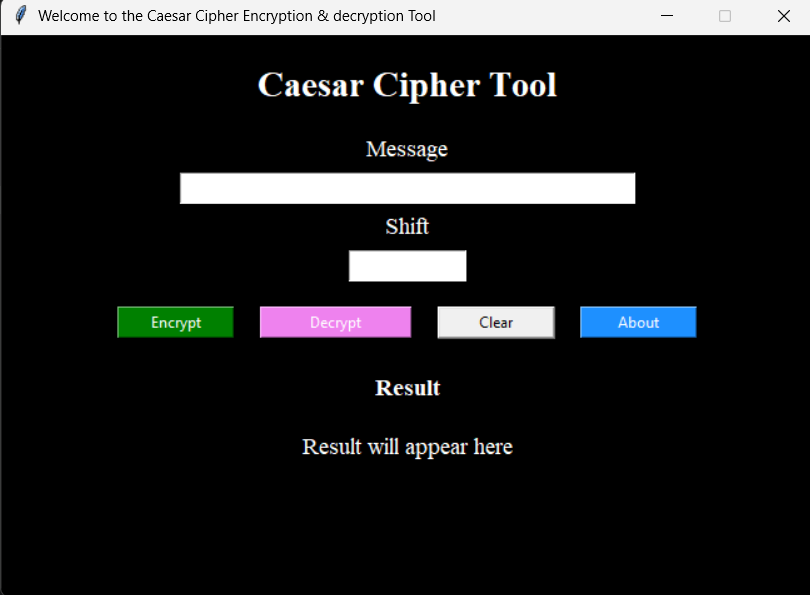
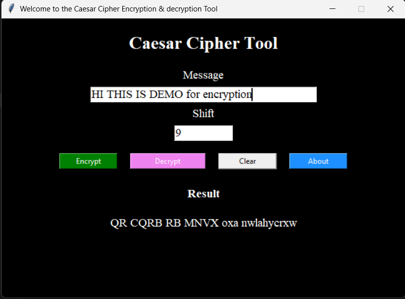
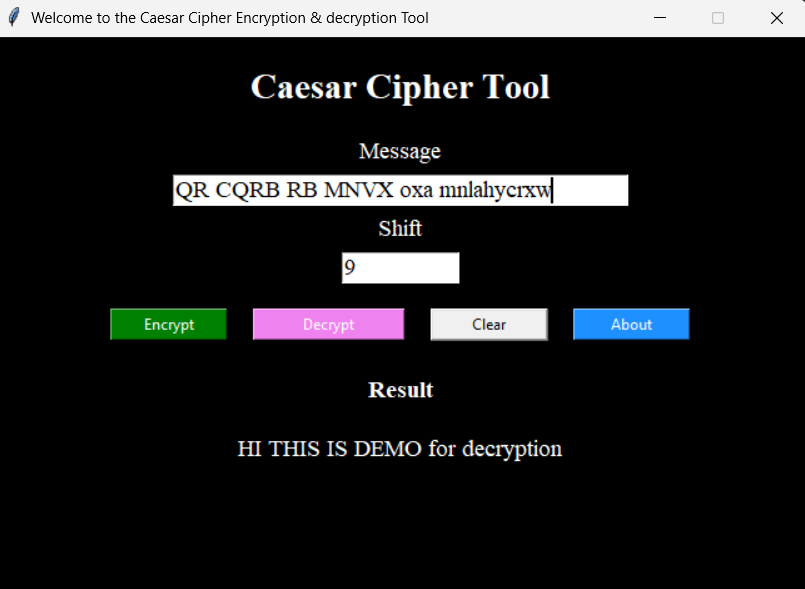

#  Caesar Cipher Encryption Tool

A Python application that encrypts and decrypts text using the **Caesar Cipher Algorithm**. This project was developed as **Task 1** of the **SkillCraft Technology Cyber Security Internship**.

---

##  Project Description

The Caesar Cipher is one of the oldest encryption techniques. It encrypts messages by shifting each alphabet letter by a fixed number of positions.

This project provides both:

- Console Version
- Tkinter GUI Version

---

##  Features

-  Encrypt text
-  Decrypt text
-  User-defined shift value
-  Handles uppercase and lowercase letters
-  Preserves spaces, numbers and symbols
-  Input validation
-  Easy-to-use graphical interface (Tkinter)
-  Clear button
-  About dialog

---

##  Technologies Used

- Python 3
- Tkinter

---

##  Project Structure

```
SCT_CS_1/
│
├── main.py             # Console version
├── gui.py              # GUI version
├── README.md
├── LICENSE
├── .gitignore
├── requirements.txt
│
└── screenshots/
    ├── home.png
    ├── encrypt.png
    └── decrypt.png
```

---

##  How to Run

### Clone the Repository

```bash
git clone https://github.com/abhiramb-web/SCT_CS_1.git
```

### Open the Project

```bash
cd SCT_CS_1
```

### Run Console Version

```bash
python main.py
```

### Run GUI Version

```bash
python gui.py
```

---

##  Screenshots

### Home Screen



---

### Encryption



---

### Decryption




##  Future Improvements

- Save encrypted text to a file
- Copy result to clipboard
- Modern CustomTkinter interface
- Dark / Light mode
- File encryption support

---

## What I Learned

- Python Functions
- Loops and Conditions
- String Manipulation
- ASCII Operations
- Caesar Cipher Algorithm
- Tkinter GUI Development
- Exception Handling
- Git & GitHub Workflow
- Project Documentation

---

## Author

**B Abhiram**

Cyber Security Intern

SkillCraft Technology

GitHub:
https://github.com/abhiramb-web

LinkedIn:
https://www.linkedin.com/in/b-abhiram-08233341b

---

##  License

This project is licensed under the MIT License.

See the **LICENSE** file for details.

---

## Acknowledgement

This project was developed as part of the **SkillCraft Technology Cyber Security Internship Program**.
